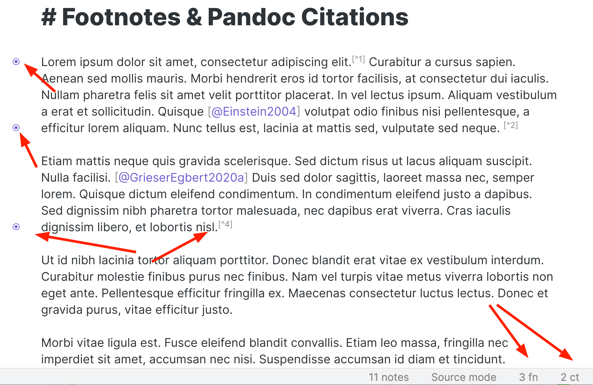

# Footnote & Citation Indicator

> __Note__  
> This plugin is archived since the status bar counters have been [integrated into the BetterWordCount plugin](https://github.com/lukeleppan/better-word-count/pull/79), which you can now use to have the same features with much more customization options.

---

  [](Changelog.md)

A plugin for [Obsidian](https://obsidian.md/) that counts footnotes & Pandoc citations. It also indicates their presence in the gutter.

That's it, that's the plugin.



## Limitations
- As Obsidian does not assign a css-class to *inline* footnotes, they can't be indicated in the gutter. (However, they are counted properly in the status bar.)

## Installation
The plugin is available in Obsidian's Community Plugin Browser via: `Settings` → `Community Plugins` → `Browse` → Search for *"Footnote & Citation Indicator"*

## Contribute
Please use the `.eslintrc` configuration located in the repository and run eslint before doing a pull request, and please do *not* use `prettier`. 🙂

```shell
# Run eslint fixing most common mistakes
eslint --fix *.ts
```

## About the Developer
In my day job, I am a sociologist studying the social mechanisms underlying the digital economy. For my PhD project, I investigate the governance of the app economy and how software ecosystems manage the tension between innovation and compatibility. If you are interested in this subject, feel free to get in touch!

<!-- markdown-link-check-disable -->
### Profiles
- [Academic Website](https://chris-grieser.de/)
- [ResearchGate](https://www.researchgate.net/profile/Christopher-Grieser)
- [Discord](https://discordapp.com/users/462774483044794368/)
- [GitHub](https://github.com/chrisgrieser/)
- [Twitter](https://twitter.com/pseudo_meta)
- [LinkedIn](https://www.linkedin.com/in/christopher-grieser-ba693b17a/)

### Donate
<a href='https://ko-fi.com/Y8Y86SQ91' target='_blank'></a>

If you feel very generous, you may also buy me something from my Amazon wish list. But please donate something to developers who still go to college, before you consider buying me an item from my wish list! 😊

[Amazon wish list](https://www.amazon.de/hz/wishlist/ls/2C7RIOJPN3K5F?ref_=wl_share)
